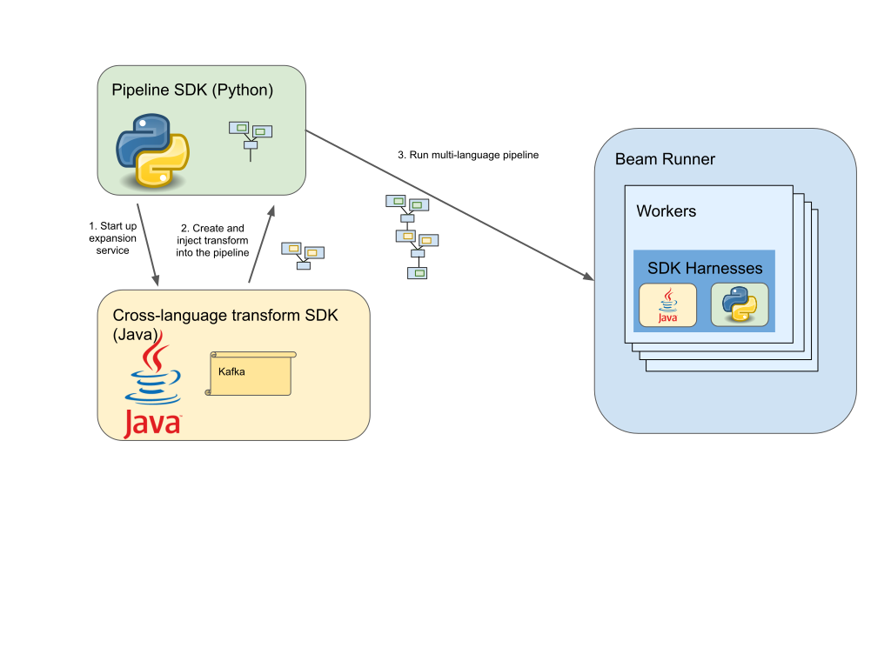

# Apache beam
Beam SDKs are used to create data processing pipelines.

## Overview
You need to first create a driver program.Your driver program defines your pipeline, including all of the inputs, 
transforms, and outputs; it also sets execution options for your pipeline. These include the Pipeline Runner, which 
determines what back-end your pipeline will run on.

The beam abstractions work with both batch and streaming data sources. Abstractions:

#### Pipeline: 
All Beam driver programs must create a **Pipeline**. When you create if the, you must also specify the execution options
that tell the **Pipeline** where and how to run.

#### PCollection:
A **PCollection represents a distributed data set that your Beam pipeline operates on**

#### PTransform:
A **PTransform** represents a data processing operation, or a step, in your pipeline. Every **PTransform** takes one or 
more **PCollection** objects as input, performs a processing function that you provide on the elements of that 
**PCollection**, and produces zero ot more output **PCollection** objects.

#### Scope:
The Go SDK has an explicit scope variable used to build a **Pipeline**. A **Pipeline** can return it’s root scope with
the **Root()** method. The scope variable is passed to **PTransform** functions to place them in the **Pipeline** that 
owns the **Scope**.

#### I/O transforms

### Typical Beam Driver Work Flow

#### Create a Pipeline

#### Create an initial PCollection
Either using the IOs (external storage) or using a **Create** transform to build a **PCollection** from in-memory data.

#### Apply PTransforms to each PCollection
A transform creates a new output **PCollection** without modifying the input collection. Think of **PCollection**s as 
variables and **PTransform**s as functions applied to these variables: the shape of the pipeline can be an arbitrary 
complex processing graph.

#### Use IOs to write final PCollection to an external source

#### Run using the designated Pipeline Runner
The Pipeline Runner that you designate constructs a **workflow graph**. That graph is then executed using the appropriate
distributed processing back-end, becoming an asynchronous "job" (or equivalent) on that back-end.

## Configuring pipeline options
### Setting PipelineOptions from command-line arguments
Use Go flags. Flags must be parsed before beam.Init() is called.

### Creating custom options

## PCollection
### Reading from an external source
Each data source adapter has a **Read** transform;to read, you must apply that transform to the Pipeline object itself.

#### PCollection characteristics
A PCollection is owned by the specific Pipeline object for which it is created; multiple pipelines cannot share a 
PCollection.

# SKIPPED FOR NOW

## Core Beam transforms
### ParDo
It's for generic parallel processing. It considers each element in the input **PCollection**, performs some processing 
function (your code) on that element, and emits zero, one, or multiple elements to an output **PCollection**.

ParDo is useful for:

1. Filtering a data set
2. Formatting or type-converting each element in a data set
3. Extracting parts of each element in a data set
4. Performing computations on each element in a data set

When you apply a ParDo transform, you'll need to provide user code in the form of a DoFn object. DoFn is a Beam SDK 
class that defines a distributed processing function.

All DoFns should be registered using a generic register.DoFnXxY[...] function.This allows the Go SDK to infer an 
encoding from any inputs/outputs, registers the DoFn for execution on remote runners, and optimizes the runtime 
execution of the DoFns via reflection.

# SKIPPED FOR NOW (Also the code of ParDo)

## Creating cross-language transform
To make transforms written in one language available to pipelines written in another language, Beam uses an expansion 
service, which creates and injects the appropriate language-specific pipeline fragments into the pipeline.

At runtime, the Beam runner will execute both Python and Java transforms to run the pipeline.

# SKIPPED FOR NOW